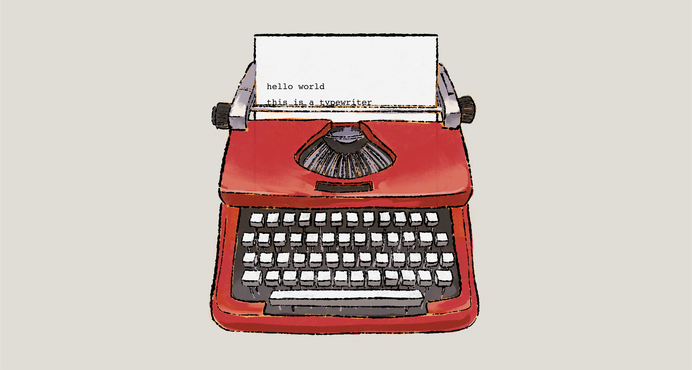

## Typewriter

An ambient, single-page typewriter where anyone can write a page and publish it to a public gallery. Built with React + TypeScript + Vite, Supabase for storage, and a focus on tactile UI.

### Live Site
- Visit the app: [typewriter-blush.vercel.app](https://typewriter-blush.vercel.app/)
- Best viewed on desktop

## Features

### Writing
- **Click or type**: On-screen keys and physical keyboard input
- **No backspace**: True to the brief; use Clear to start over
- **12-line hard cap**: One page only
- **Paper movement**: Paper and text advance together on line breaks

### Publishing & Gallery
- **Publish to public gallery**: Name is optional and moderated
- **Client-side moderation**: Profanity filtered for name and text
- **Shareable links**: `/writing/:id` routes for individual works
- **Gallery previews**: Mini papers with scaled text; click to enlarge

### Designed to Delight
- **Floating nav**: Top-right, transparent, zero layout height
- **Bottom-left controls**: Publish and Clear
- **Geist Mono**: Global font for all text
- **Publish animation**: Paper + text float up (≤1s, ease-in)
- **Reduced motion**: Respects `prefers-reduced-motion`

## Tech Stack

- React, TypeScript, Vite
- Supabase (PostgreSQL, REST)
- React Router
- bad-words (client-side moderation)
- @fontsource/geist-mono, @phosphor-icons/react

## Future Updates

- Improved profanity detection
- Different fonts/colors
- Different typewriter variations
- Sound effects
- Improve mobile interface
